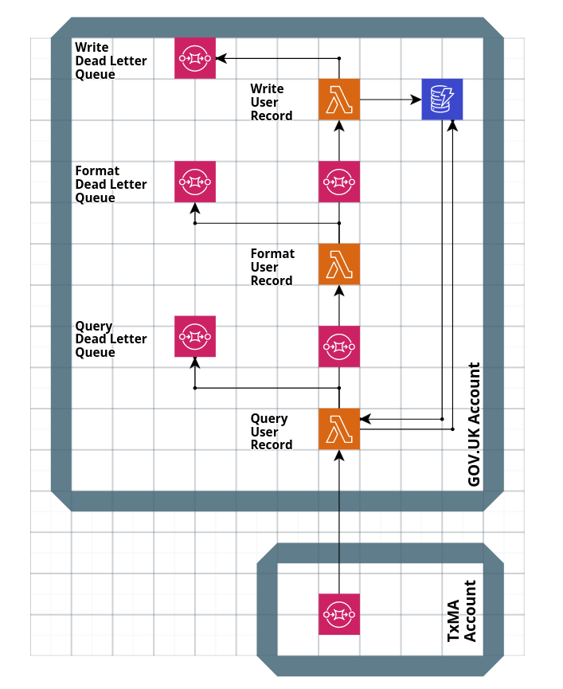

# Persisting "Services you have used" Data within the account

## Summary

To support a user visible history of services they have used ("Service Cards"), a defined summary of audit events will be published from TxMA to an SQS endpoint residing in TxMA, (see [alphagov/digital-identity-architecture#279](https://github.com/alphagov/digital-identity-architecture/pull/279)).

This will then be read by a series of GOV.UK Account team managed Lambdas that process and store which services each user has used.

Code standards follow [GOV.UK One Login's Serverless Best Practices](https://govukverify.atlassian.net/wiki/spaces/DISBP/overview) for lambdas and [DI Dev Platform](https://govukverify.atlassian.net/wiki/spaces/PLAT/overview) guides for deployment.

Code and configuration will be stored in a new repository [di-account-management-backend](https://github.com/alphagov/di-account-management-backend).

## Context

There is the requirement to allow users to see which services they have accessed, and have that data stored against their account, so we can personalise the account management user interface.

See also [alphagov/digital-identity-architecture#279](https://github.com/alphagov/digital-identity-architecture/pull/279) for context on data sources.

We will constrain ourselves by prior ADRs that limits options here.

[ADR 0038 Backend Node.js/TypeScript](https://github.com/alphagov/digital-identity-architecture/blob/main/adr/0038-backend-nodejs-typescript.md) and [ADR 0037 Using external dependencies in production with Node.js/NPM](https://github.com/alphagov/digital-identity-architecture/blob/main/adr/0037-nodejs-npm-production-dependencies.md) guide the choice of Node as a default, we have no cause to deviate.

We have reviewed [ADR 0025 Relaxing serverless constraints for MVP](https://github.com/alphagov/digital-identity-architecture/blob/055042de6374a99d646272022177a0d8da6fcd4e/adr/0025-relaxing-serverless-constraints.md) and believe that we can provide a serverless implimentation within our delivery window that meets [GOV.UK One Login's Serverless Best Pratices](https://govukverify.atlassian.net/wiki/spaces/DISBP/overview) and [DI Dev Platform deployment standards](https://govukverify.atlassian.net/wiki/spaces/PLAT/overview), so we have chosen to avoid accruing further technical debt.

These previous decisions focus us towards the option below.

A key assumption is that standard AWS security practices of access controls and default DynamoDB encryption meet our security standards given the sensitivity of user data stored. Data will be encrypted at rest with an AWS managed key, as [the default encryption configuration](https://docs.aws.amazon.com/amazondynamodb/latest/developerguide/EncryptionAtRest.html) for a DynamoDB table

## Decision

As a result of prior ADRs we have decided to:

- Use DynamoDB as our data store, encrypted at rest with a non-default KMS key
- Write small, single responsibility lambdas written in Typescript with minimal production dependencies
- Separate of lambdas with SQS Queues to allow for async processing and scaling
- Use dead letter queues to monitor and capture data from handled errors.

We will store a single record per user and update that record as the users logs in to more services. This will make querying for a user's data very fast which is important, as the query will be blocking the synchronous user-facing HTTP request to load the service dashboard.

This means the time between us receiving an event from TxMA and writing it to the data store will be slightly longer since we're doing the data processing upfront. That's ok because data ingestion is an asynchronous, non-user facing process. Based on testing we expect it to take under 1 second in the worst case scenario when each lambda has to cold start which is an acceptable latency.

These will be structured as follows:



### Lambdas

#### Query User Services

Will take a TxMA event and query the existing service record for a user.
It will then pass on the TxMA event and optionally any existing service record.

#### Format User Services

Will take the TxMA event and an optional service record and either create a new service record data structure, add a new service to the existing list, or increment the `count_successful_logins` for an existing service by one.

A single service record payload will be written onwards

#### Write User Services

Will take a single formatted service record and attempt to write it to DynamoDB.

#### SQS Queues

Each lambda will be separated by an SQS Queue.
Each lambda will have it's own Dead Letter Queue.

Data on services will be stored against a User ID that we can match to the Account Management RP's session. Data will be persisted in the following format:

### Service record data structure

```typescript
type UrnFdnSub = string;
type ClientId = string;

export interface UserServices {
  user_id: UrnFdnSub;
  services: Service[];
}

export interface Service {
  client_id: ClientId;
  count_successful_logins: number;
  last_accessed: number;
}
```

See [models.ts](https://github.com/alphagov/di-account-management-backend/blob/main/lambda/write-user-services/models.ts)

### Data storage

- Data stored in DynamoDB will be encrypted at rest with a customer managed key
- We will enable [point-in-time recovery](https://docs.aws.amazon.com/amazondynamodb/latest/developerguide/PointInTimeRecovery.html) on any DynamoDB tables to allow for disaster recovery
- We will use [server side encryption for messages in SQS](https://docs.aws.amazon.com/AWSSimpleQueueService/latest/SQSDeveloperGuide/sqs-server-side-encryption.html), using a customer managed key

## Consequences

- A new site of persisted user data will be created on the programme.
- Users data will need to be removed if an account is deleted.
- GOV.UK One Login's privacy policy will need to be reviewed to ensure these changes do not require modification of its terms.
- Stored user data will need to be considered for any future Subject Access Request policy.
- GOV.UK Account team will need to ensure security of persisted data meets whatever security standards GOV.UK One Login Architects wish to provide.
