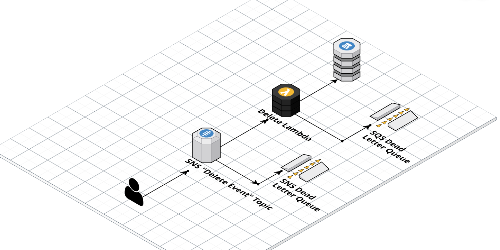

# Deleting "Services you have used" Data within the account

## Summary

- We will remove data from the account data store when a user deletes their account.
- We will implement this just for the GOV.UK Account, but be aware of future program needs.
- We will follow serverless best practices in our implementation.

## Context

In [0003-recording-service-usage-in-account](./0003-recording-service-usage-in-account.md), we decided to create a new persisted store of user data to power the "Service cards" feature.

This store is separate from others, and will be unaware that an account has been deleted unless we intervene.

We have GDPR responsibilities to persist data for as long as we need it, and no longer. When a user deletes their account, we no longer have a need to store their service data, as its sole use is to personalise the user interface in their account.

We must ensure that when a user deletes their account their service data is also removed.

## Decision

We will set up a serverless infrastructure, triggered upon a user deleting their account.

The event will contain a user_id matching the desired record in the data store.

We will write through a series of queues to a lambda which will issue a delete command for that record.

Failure of the delete lambda will lead to the population of a dead letter queue, triggering an alert.

We have decided to add complexity with an SNS Queue and components needed to populate it.
Whilst this feature will be the sole consumer of delete events, we recognise other stores of user data may appear around the program. Using SNS means others can choose to subscribe to this event in future for their own actions.

Alternatively the SNS component could be delegated to another account in future, perhaps TxMA.

### Diagram

## Other options considered

We could simplify the arrangement by removing SNS. However a general need for the program to be alerted to delete events and take actions is only likely to grow. Whilst this is a premature optimisation it feels like a pragmatic one at this stage, and the cost of extra infrastructure is low.

We could also engage in a wider project now, encouraging the adoption of a cross program SNS queue (by another team). However, that could force other teams to act before they are ready, we would be the sole initial consumer, and it would increase delivery risk.

Putting in an SNS queue now should make a refactor easy later.

## Consequences

- GDPR risk of holding data is mitigated
- Feature meets users expectations of data removal with an account
- Added infrastructure and costs
- Subsequent work for GOV.UK teams to discuss a cross program delete method with other teams
