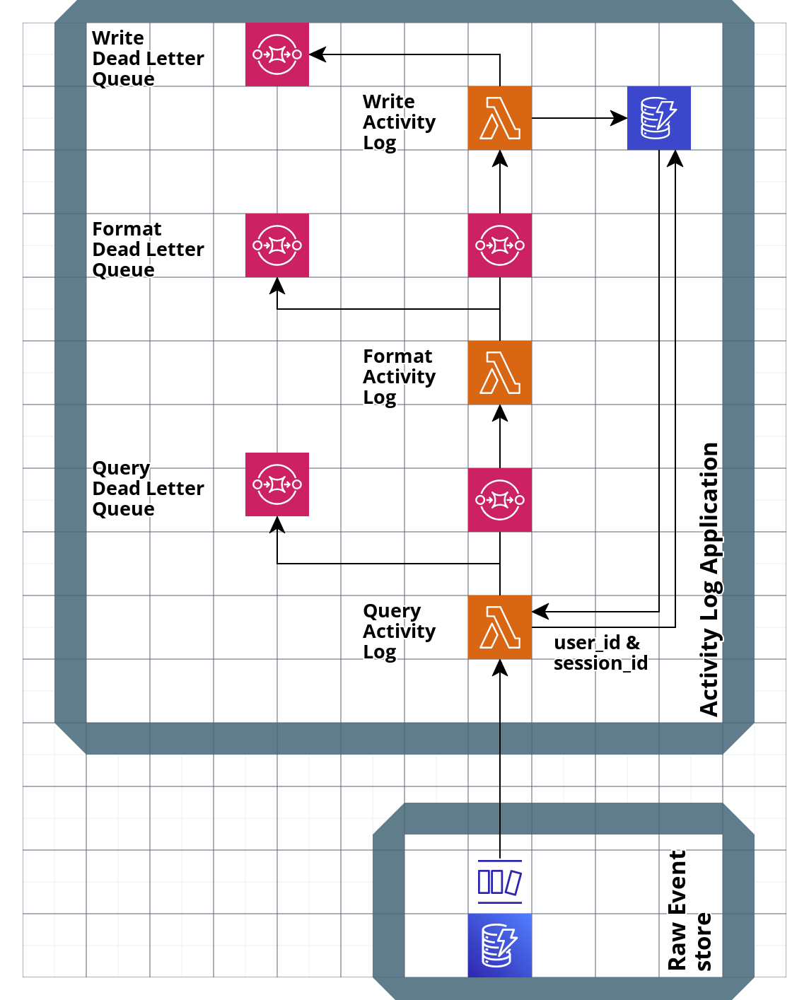

# Persisting "Activity log" Data within the account

## Summary

## Context

We are adding a feature to the account management dashboard that will allow users to see a log of events. These will represent allowed events to be exposed to the user. The aim is to help meet our transparency obligations to the user, to help them gain a broad understanding of how their account has been used and also to spot where there may have been suspicious patterns of usage they wish to query with our security or fraud teams.

This event log is expected to grow to incorporate many kinds of audit events. The initial implementation will focus solely on a "signed in event" that represents when the user has successfully completed the login form and started a new session having asserted their ownership of an account to [GPG-44 levels](https://www.gov.uk/government/publications/authentication-credentials-for-online-government-services). Note that differs from OIDC authentications (covered in more detail below).

This work builds upon existing architecture within the account including:

- [0003-recording-service-usage-in-account](./0003-recording-service-usage-in-account.md)
- [0004-store-all-event-data](./0004-store-all-event-data.md)

It reaffirms the decisions referenced in 0003-recording-service-usage-in-account. Specifically:

- The decision to use [Node.js / Typescript](https://github.com/alphagov/digital-identity-architecture/blob/main/adr/0038-backend-nodejs-typescript.md)
- [GOV.UK One Login's Serverless Best Pratices](https://govukverify.atlassian.net/wiki/spaces/DISBP/overview)

As in our existing data stores we are following the same key assumption that standard AWS security practices of access controls and default DynamoDB encryption meet our security standards given the sensitivity of user data stored. Data will be encrypted at rest with an AWS managed key, as [the default encryption configuration](https://docs.aws.amazon.com/amazondynamodb/latest/developerguide/EncryptionAtRest.html) for a DynamoDB table.

The data to power this feature will originate in the Authentication and IPV core applications. From there it will be sent to the Transaction Audit and Monitoring system (TxMA). All access to TxMA data is gated through the [TxMA self service application](https://github.com/govuk-one-login/txma-event-self-serve) and process. We have no access to any audit data other than what they have approved. The Account Management Frontend remains a consuming reader of events from elsewhere in the system.

## Decision

After exploring a range of options, we have decided to repeat the model we used for [0003-recording-service-usage-in-account](./0003-recording-service-usage-in-account.md). That is:

- Use DynamoDB as our data store, encrypted at rest with a non-default KMS key.
- Write small, single responsibility lambdas written in Typescript with minimal production dependencies.
- Separate lambdas with SQS Queues to allow for async processing and scaling.
- Use dead letter queues to monitor and capture data from handled errors.
- Draw events into the system from a Raw Event Store that captures all events from TxMA.

> NOTE: The below architecture has been superseded by [ADR 0010](./0010-simplify-activity-log-data-structure-pipeline.md)

We will store a record indexed by `user_id` and then update that record as the user "visits" more services. This will make querying for a user's data very fast which is important, as the query will be blocking the synchronous user-facing HTTP request to load the service dashboard.

This means the time between us receiving an event from TxMA and writing it to the data store will be slightly longer since we're doing the data processing upfront. That's ok because data ingestion is an asynchronous, non-user facing process. Based on our previous investigations we'd expect the full pipeline to process a record in under 1 second in the worst case scenario when each lambda has to cold start which is an acceptable latency.

These will be structured as follows:



## Availability of data within the system

Our product and UCD team had to decide what qualified a "sign in" event based on existing signals so we would choose when to render the events.

This decision is made less straightforward by the following factors:

- A user may be signed into a service (RP) and not to GOV.UK One Login
- A user may be signed into GOV.UK One Login and not to a service
- A user may be signed out of both, and seeing to authenticate for an auth only service
- A user may be signed out of both, and seeking to authenticate for an ID service, that could take many days to complete if they took the Face-to-Face option to be identified.

The framing of this event was describing when the user had "signed in". We believe the user will best understand this moment as "when they have successfully completed the login form". This is a distinct moment from the OIDC system responding to an RP that the user is now "authenticated". In particular we make that distinction because after "signing in" a user may be bumped over to the identity system, which may take some time to complete. We wish for a user to understand they have "signed in" to do their identity check, but have not yet "visited" a service as a result.

Auth / Orchestration do not currently emit an event that perfectly matches these needs. They may not be able to do so until after a potential decoupling of functions in that team.

In the meantime we have chosen to derive the event we need from two separate circumstances that always occur immediately after the user will have completed the sign in form.

- `AUTH_AUTH_CODE_ISSUED` - Indicating a user is being sent back to an RP, and so must have successfully signed in. This will cover all events, but is particularly relevant here for the "auth only" journeys where the identity system is not touched.
- `AUTH_IPV_AUTHORISATION_REQUESTED` - An initial event that signals a new identity journey has just begun for this user and the Auth system has received a request to authorise that user. This will tell us a user has successfully signed in and is now beginning an ID journey.

We would take whichever occurs first during a session (identified by a unique `session_id` produced by auth), and use that to create a "Signed in event". The timestamp will also be taken of whichever event triggers creation. Where the trigger is an `AUTH_AUTH_CODE_ISSUED` we will also be able to add an initial "visited" service.

After this point every subsequent `AUTH_AUTH_CODE_ISSUED` event will be used to signal that a user has "Visited" a service, enhancing their log of events.

## Architecture of the system

The system consists of a mix of lambdas, SQS and dynamoDB for persistence.

### Query Activity Log

Will take a new event from TxMA from [the raw event store](./0004-store-all-event-data.md) and query the activity log store for a record with a matching `user_id` and `session_id`.

This differs from the User Service store in it's scoping to session. We are interested in updating records here where there is continued activity from within a session, otherwise it is just a "new activity log event".

The query lambda retrieves data then passes both the TxMA event and any retrieved data on to an SQS queue.

It will also filter out events that are not deemed relevant to producing signed in activity logs, specifically we will only take events from the Raw Event Store dynamoDB stream that are of type:

- `AUTH_AUTH_CODE_ISSUED`
- `AUTH_IPV_AUTHORISATION_REQUESTED`

Any other events will be discarded.

### Format User Services

Will take the TxMA event and any retrieved data and either:

- Create a new event if nothing was retrieved with that `session_id`. In this case this is the first event we have detected for that session, and so would be treated as a new "Signed In Event" irrespective of if they are `AUTH_AUTH_CODE_ISSUED` or `AUTH_IPV_AUTHORISATION_REQUESTED`. This will create a new "Signed In" Log Event
- If data has been returned by `session_id` then after that point any authentication (`AUTH_AUTH_CODE_ISSUED` event) will be treated as the user having "visited" a service, resulting in an update to the queried event with data from TxMA.

After the data structures have been reconciled it will be passed on to the write lambda.

### Write User Services

Will take a single formatted service record and attempt to write it to DynamoDB.

### SQS Queues

Each lambda will be separated by an SQS Queue.
Each lambda will have it's own Dead Letter Queue.

Data on services will be stored against a User ID that we can match to the Account Management RP's session. Data will be persisted in the following format:

### Service record data structure

```typescript
type UrnFdnSub = string;
type ClientId = string;
type SessionId = string;

export interface UserData {
  user_id: UrnFdnSub;
  govuk_signin_journey_id: string;
  session_id: string;
}

export interface TxmaEvent {
  event_id: string;
  timestamp: number;
  timestamp_formatted: string;
  event_name: string;
  client_id: ClientId;
  user: UserData;
}

export interface Activity {
  type: string;
  client_id: string;
  timestamp: number;
}

export interface ActivityLogEntry {
  event_type: string;
  session_id: string;
  user_id: string;
  timestamp: number;
  activities: Activity[];
  truncated: boolean;
}
```

See [shared-models.ts](https://github.com/govuk-one-login/di-account-management-backend/blob/main/lambda/shared-models.ts)

### Data storage

- Data stored in DynamoDB will be encrypted at rest with a customer managed key
- We will enable [point-in-time recovery](https://docs.aws.amazon.com/amazondynamodb/latest/developerguide/PointInTimeRecovery.html) on any DynamoDB tables to allow for disaster recovery
- We will use [server side encryption for messages in SQS](https://docs.aws.amazon.com/AWSSimpleQueueService/latest/SQSDeveloperGuide/sqs-server-side-encryption.html), using a customer managed key

## Other options considered

As a log of events that grows over time we considered a model of "append only" database, following a [conflict-free replicated data type (CRDT)](https://en.wikipedia.org/wiki/Conflict-free_replicated_data_type) model.

The desire for this was based around a few principles:

- A much simpler architecture, by doing all processing "just in time" instead of in advance.
- Resilience against potential data migrations by storing data in a raw format and only changing how we process it.
- The ability to replay past events without fear of data having been updated or modified.

Whilst these advantages were attractive, upon doing a spike we found this use case to not be suitable.
Our implementation requires aggregation across events (to display a signed in event with the context of what they visited within that session). The absence of a performant `GROUP BY` function in DynamoDB prevented pushing aggregation to the database layer. Instead we would have needed to request all data for a user back to a lambda where it could then be grouped and paginated.

We decided to test this against high numbers of user records, and found a response time of around 19 seconds for logs with 100,000s of events (a number we will likely reach though probably not soon).

Having spent time on the spike, we decided to revert to the initial data model that aligned with our existing service store.

## Consequences

- The Raw Event store expands its scope to read in `AUTH_IPV_AUTHORISATION_REQUESTED` events.
- The existing service cards store will need to filter out `AUTH_IPV_AUTHORISATION_REQUESTED` events.
- A new site of persisted user data will be created on the programme.
- Users data will need to be removed if an account is deleted. We can follow a similar model to [our existing delete infrastrucure](https://github.com/govuk-one-login/di-account-management-backend/blob/main/docs/adr/0005-deleting-service-usage-in-account.md).
- Stored user data will need to be considered for any future Subject Access Request policy.
- GOV.UK Account team will need to ensure security of persisted data meets whatever security standards GOV.UK One Login Architects wish to provide.
