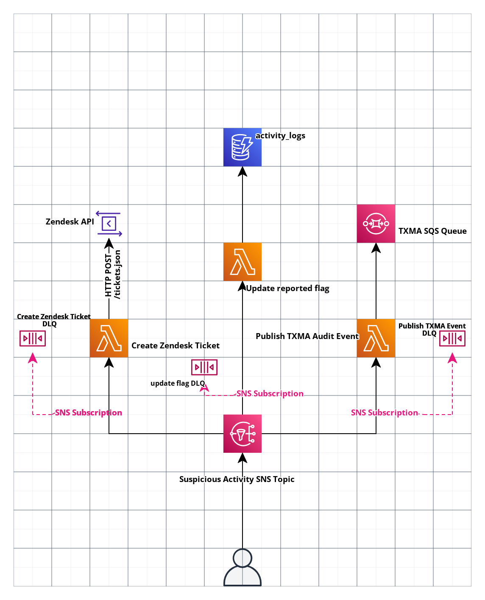

# Reporting a Suspicious activity

> [!IMPORTANT]
> This ADR has been superseded by [ADR 0013](./0013-contact-form-for-reporting-activity.md).

## Summary

- We will create a Zendesk ticket when an activity is reported .
- We need to publish an audit event to [TXMA] (https://govukverify.atlassian.net/wiki/spaces/TMA/pages/3414753375/Introduction+to+TxMA) which will be consumed by the fraud team.
- Update the reported flag in `activity_logs` dynamo table

## Context

Users need to be able to report sign in events from their ‘activity log’ which they do not recognise.

We need to make sure that:

- We collect data about the event the user is suspicious of, and about the account affected - ideally without the user having to enter anything

- When a user submits a report, Zendesk will create a ticket containing the right information in the TICF 2nd line group.

- An audit event is created in TXMA which can then be distributed out from there.

- The repoted flag on the activity_logs table should be updated to true. This will ensure that the event is repoted only once.

- The user gets an immediate auto-response setting their expectations as to what will happen next

## Decision

We will set up an SNS topic for a report of a suspicious event, triggered upon a user submitting the contact form.

The event will contain user details along with the events details .
The format of the SNS payload should be

```
{
    user_id: USER_ID,
    email_address: USER_EMAIL
    persistent_session_id: CURRENT_SESSION_ID,
    session_id: SESSION_ID,
    reported: true
    reported_event: {
        event_type: EVENT_TYPE,
        session_id: SESSION_ID,
        user_id: USER_ID,
        timestamp: TIMESTAMP,
        activities: {
            type: EVENT_TYPE,
            client_id: CLIENT_ID
            timestamp: TIMESTAMP,
            event_id: EVENT_ID
        }

    }

}
```

We will subscribe 3 lambda to the topic for now.

The first lambda will take the details and create a payload with the relevant information.
This lambda is responsible for making an HTTP POST to the /tickets.json endpoint on the [Zendesk API](https://developer.zendesk.com/api-reference/ticketing/tickets/tickets/) allowing the creation of a ticket.
A DLQ will be configured on the subscription so that messages which can’t be delivered to the Lambda or those that fail validation are redirected to the queue for further analysis or reprocessing.
Zendesk will be configured to send a confirmation email to the users.

The second lambda will publish an audit event to TXMA.
This can be achieved by sending a message with the correct fields on the TXMA SQS queue.
This will be received by the teams pulling from the SQS.
Similar to the other lambda, a DLQ will be configured on the subscription so that messages which can’t be delivered to the Lambda or those that fail validation are redirected to the queue for further analysis or reprocessing.

The third lambda is to update the activity_logs dynamo db table and add a reported flag. This flag is checked before the user is allowed to report an event. If the flag is set then the user will be unabe to report the particular event. We want to keep this labda seperate from the write_activity_log lambda because we want to only allow the reported flag to be added and all the other feilds should be untouched.

### Diagram



## Consequences

- Only using AWS tools we're already familiar with
- If an event fails processing attempts, the Lambda functions are configured to send the invocation record to separate DLQs.
