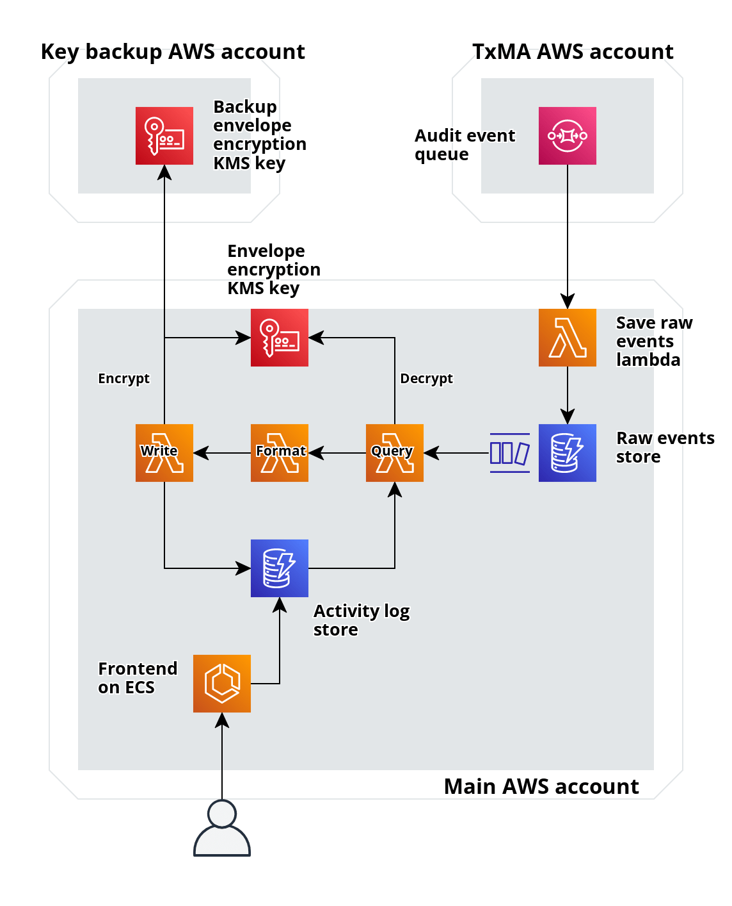

# Backup keys for envelope encryption

## Decision

We will store a second envelope encryption key in a separate AWS account for disaster recovery.

> NOTE: The below architecture has been superseded by [ADR 0010](./0010-simplify-activity-log-data-structure-pipeline.md)

## Context

In the [programme ADR 0122](https://github.com/govuk-one-login/architecture/blob/main/adr/0122-secure-storage-accounts-data.md) we decided to require [envelope encryption for](https://docs.aws.amazon.com/encryption-sdk/latest/developer-guide/concepts.html#envelope-encryption) long term data stores in our AWS accounts.

Best practice for disaster recovery when using envelope encryption is to use at least encryption keys in case we lose access to one.
In GOV.UK One Login we require two encryption keys. We have several options for how we do this:

### Both keys in the same AWS account and region

Pros:

- Simplest to implement

Cons:

- Doesn't mitigate against a threat actor gaining access to our main AWS account and deleting KMS keys
- Doesn't mitigate against an AWS disaster in the London region

### Both keys in the same AWS account but different regions

Pros:

- Mitigates against an AWS disaster in the London region
- Could use multi-region KMS keys to simplify implementation

Cons:

- Doesn't mitigate against a threat actor gaining access to our main AWS account and deleting KMS keys

### Keys in different AWS accounts but same region

Pros:

- Mitigates against a threat actor gaining access to our main AWS account and deleting KMS keys

Cons:

- Doesn't mitigate against an AWS disaster in the London region
- We have to set up and manage a second set of AWS accounts

### Keys in different AWS accounts and regions

Pros:

- Mitigates against a threat actor gaining access to our main AWS account and deleting KMS keys
- Mitigates against an AWS disaster in the London region

Cons:

- Most complex to implement
- We have to set up and manage a second set of AWS accounts

At the time of this decision, the programme has not yet agreed to the use of AWS resources outside the London (eu-west-2) region.
This means we cannot choose any multi-region options.

We have decided to use keys in different AWS accounts but same region.
This gives us the most mitigations aginst potential threats and disaster scenarios while working within the single-region restriction.

We already have a set of AWS accounts (`di-account-data-*`) which are currently empty and can be used to store the second key.

## Consequences

- We have to set up and manage a second set of AWS accounts
- We will need to set up cross-account permissions to allow Lambda functions in our main AWS account to call KMS in the second account
