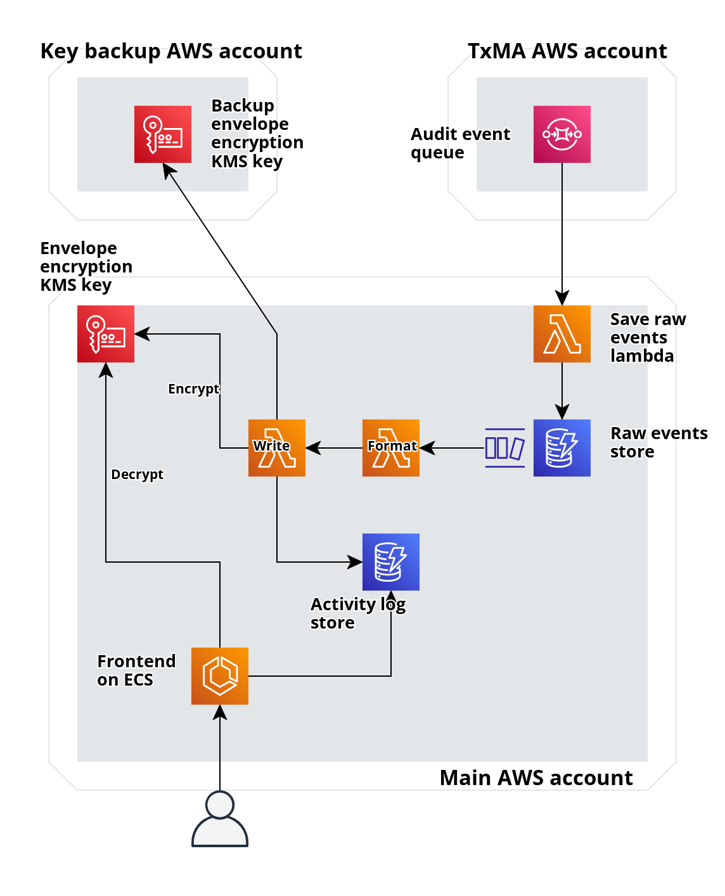

# Simplify activity log data structure & pipeline

## Decision

We will change the activity log data structure to store each event as a separate item in DynamoDB.

We will encrypt the `event_type` attribute on each item to preserve user privacy.

We will use a composite primary key for the table of `user_id` and `event_id`.
This will allow us to retrieve all events for a user (by querying with the `user_id`) and individual events (by querying with `user_id` and `event_id`).

The new structure for each item in DynamoDB will be:

| Property              | Column Type   | Data Type | Description                                                                                    |
| --------------------- | ------------- | --------- | ---------------------------------------------------------------------------------------------- |
| `user_id`             | partition key | string    | The unencrypted user ID from the incoming event                                                |
| `event_id`            | sort key      | string    | The unencrypted event ID from the incoming event                                               |
| `event_type`          |               | string    | The envelope encrypted event type from the incoming event                                      |
| `session_id`          |               | string    | The unencrypted session ID from the incoming event                                             |
| `client_id`           |               | string    | The unencrypted client ID from the incoming event                                              |
| `timestamp`           |               | string    | The unencrypted timestamp from the incoming event                                              |
| `reported_suspicious` |               | boolean   | If the user has reported this event as suspicious. This will always be false on initial write. |

This data structure is much simpler than before which allows us to simplify the pipeline.
We no longer need to query DynamoDB for an existing item before updating it, so we can remove the `query-activity-log` Lambda.
We will subscribe the `format-activity-log` Lambda to the raw events DynamoDB stream.

The new architecture will be:

## Context

In [ADR 0006](./0006-recording-activity-log-data-within-the-account.md) we decided on a data structure for the activity log.
This used one item in DynamoDB per user and session which had an attribute with a list of events for the session.

We decided on this structure to minimise the number of items in the table as we weren't sure how fast DynamoDB would be when querying a table with many many items.
Results from other teams show we don't need to worry about this - DynamoDB is plenty fast enough with the right indices.

Since the original design, we have also had a new requirement for this feature, as well as discussions about potential future requirements.
We may need to allow users to report individual events, or multiple events at once, rather than reporting a whole session.

A simpler data structure where each event is a separate item allows us to be more flexible in how we meet this and future requirements.
We could use this single table with all relevant event data to power all planned and current features of the account home application, including service cards.

This may allow us to migrate users' data from the existing user services table into this new structure and further simplify our backend.

### Access patterns

In this new design, there are 4 ways we'll need to query from or write to this table:

1. Write from the `write-activity-log` Lambda when a new event is recieved.
2. Query for all a user's events from the frontend.
3. Query for a single event from the frontend.
4. Update a single event to mark that it's been reported from a new Lambda in the backend

Using a composite primary key for the table of `user_id` and `event_id` allows us to meet all these access patterns without needing any secondary indices.

We can query a composite primary key using only the partition key, so we'll use `user_id` as the partition key and be able to retrieve all a user's events with only their `user_id`.
We'll also have access to the user's `user_id` when we need to query for or update a single event - either from the user's session in the frontend or in the SNS message in the backend.
This means we'll be able to use the full composite key to retrieve or write back a single event without a table scan.

## Consequences

- We will need to do extra work in our backend to remove the `query-activity-log` lambda.
- Querying for a user's activity in the frontend will be simpler.
- We will be able to add new attributes to stored events more easily, speeding up future work.
- We will be able to use DynamoDB to sort and filter events rather than writing our own code in the application
