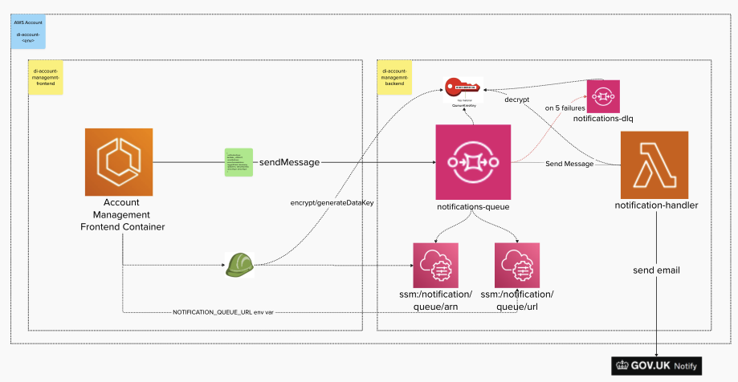

# Design for emitting email requests to GOV Notify
Establish a pattern for implementing a capability to send notifications via Gov Notify

## Context
For Global Logout, security would like the user to receive an email informing them of the activity.

## Decision
We will use SQS and a Lambda to make calls to send emails though Gov Notify

## Options Considered

### Option 1 - Lambda and SQS (Chosen)
Standup a SQS queue with a lambda that consumes events that calls Gov Notify to send emails.

#### Detailed flow

1. The Account Management Frontend will send messages to a Notification Queue with the user's email address along with other info required for the email template stored in Gov Notify.
2. A lambda shall consume the event, based on the notification type, select the appropriate template id and supply the template's dynamic content.
3. The lambda will then make a call to Gov Notify to send the email.
]

### Option 2 - API and Lambda
Similar to Option 1 but frontend by a private API that invokes the lambda.

This was discounted as this process does not need to be synchronous and SQS is durable.

